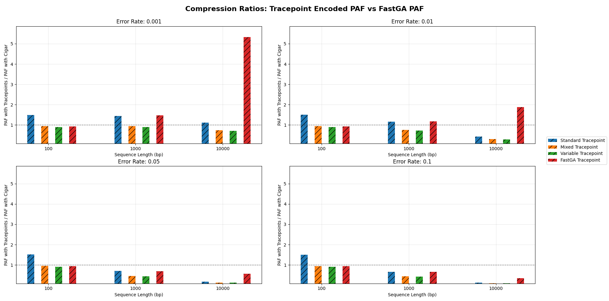
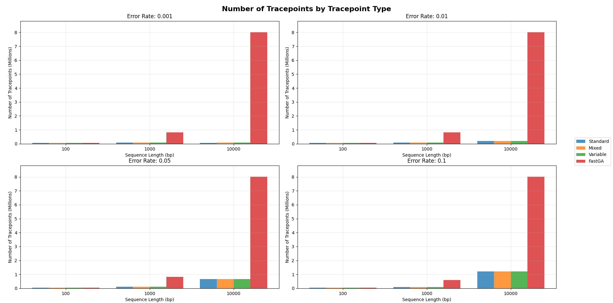
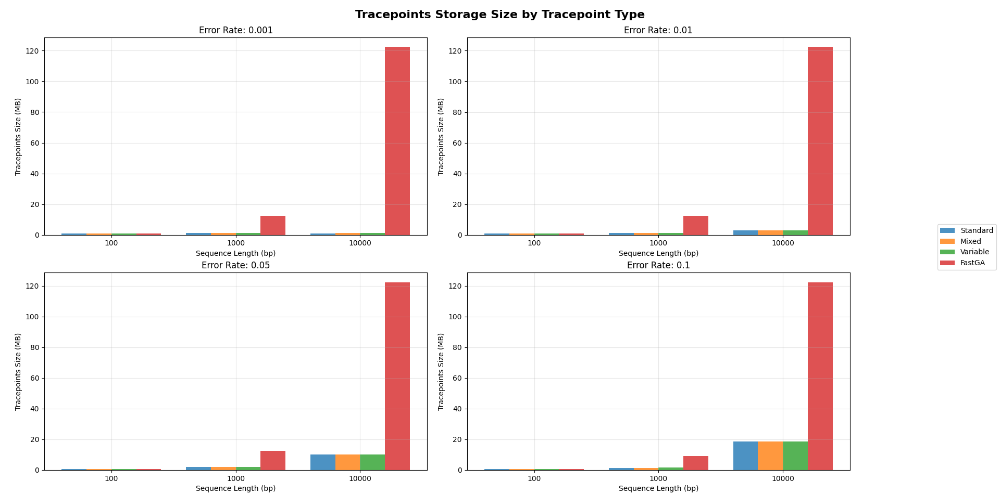
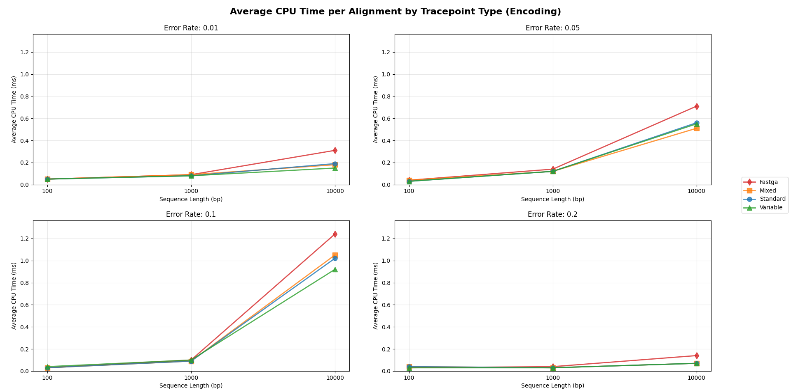
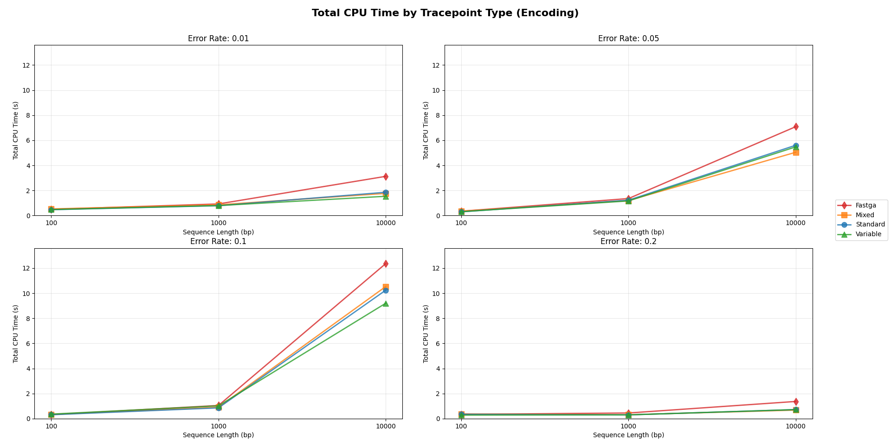
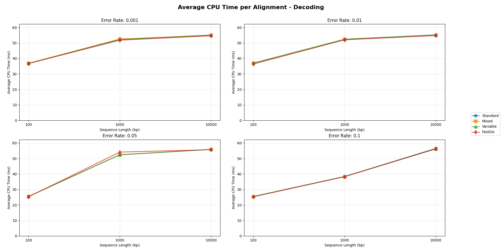
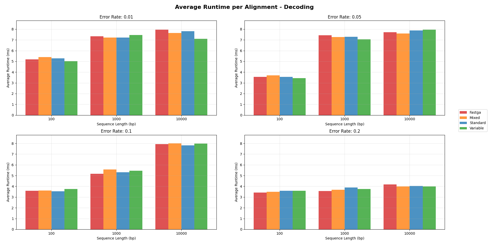
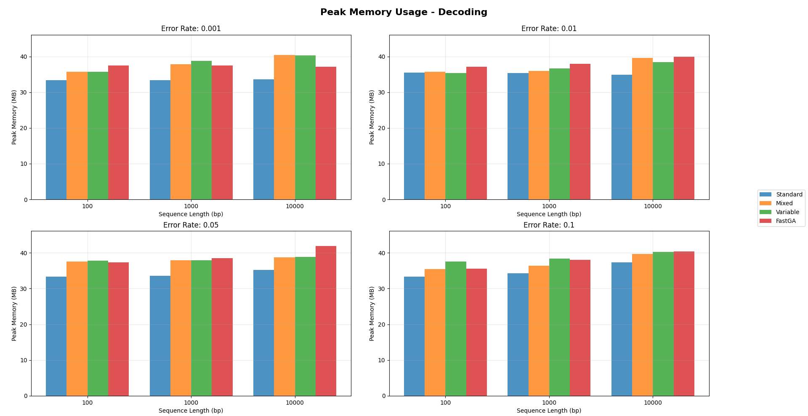
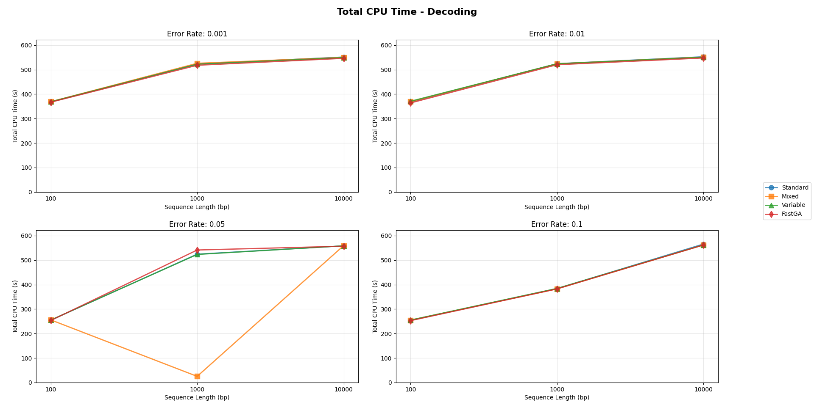

# Tracepoints Analysis Results

This document presents the analysis results for different tracepoint types across various sequence lengths and error rates.

## 1. Compression Ratios

The compression ratio analysis shows how efficiently each tracepoint type compresses the PAF files compared to the original FastGA PAF format.

## 2. Tracepoint Counts

This chart displays the number of tracepoints generated by each tracepoint type for different sequence lengths and error rates.

## 3. Tracepoint Storage Size

The storage requirements for tracepoints in megabytes (MB) across different configurations.

## 4. Average CPU Time per Alignment (Encoding)

Processing time per individual alignment in milliseconds for each tracepoint type.

## 5. Total CPU Time (Encoding)

Total processing time in seconds for encoding all 10,000 alignments.

## 6. Average CPU Time per Alignment (Decoding)

Processing time per individual alignment in milliseconds for each tracepoint type during decoding.

## 7. Average Runtime per Alignment (Decoding)

Wall-clock runtime per individual alignment in milliseconds during decoding.

## 8. Peak Memory Usage (Decoding)

Maximum memory consumption during decoding process for each tracepoint type.

## 9. Total CPU Time (Decoding)

Total processing time in seconds for decoding all 10,000 alignments.

